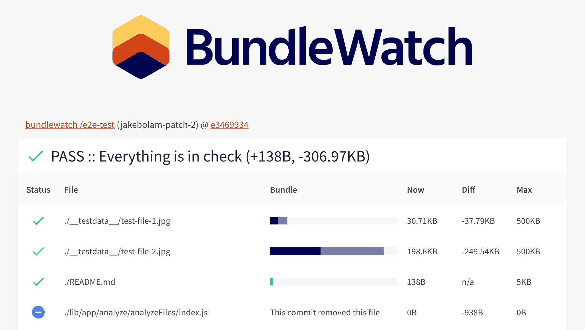

# The Best Parts
Bundlesize can report when files are over maxSize, but bundlesize can also
- Report build status back to GitHub
- Show you how much files have changed (against develop, master etc)

## Build Status and diffing
Lets run through getting setup up with build status

### CI Variables needed by bundlesize
The most efficient way to get this running is to ensure that some environment variables are available for bundlesize to find.
- `CI_REPO_OWNER` github.com/**facebook**/react
- `CI_REPO_NAME`  github.com/facebook/**react**
- `CI_BRANCH`
- `CI_COMMIT_SHA`

If you're using, _Travis_, _CircleCI_ or _Wrecker_ these should all work out of the box.

!> Have a look at the source code to see which variables are automatically found: https://github.com/bundlesize/bundlesize/blob/master/src/app/config/ciEnv.js#L36-L39

> If CI variables aren't for you, you can also set them using config files, or the Node API.

### CI Auth Variables needed by bundlesize
- `BUNDLESIZE_GITHUB_TOKEN`

You will need to to allow bundlesize access to your GitHub Statuses, you can do this by heading to:
https://service.bundlesize.io/setup-github

This will give you, your `BUNDLESIZE_GITHUB_TOKEN`. You will need to set this as environment variable in CI.

!> Ensure you keep this token secret, so rouge parties can't write to your repo statuses

## Diffing against branches other than master
After setting up the above, you should already have diffing for master.

If you want to setup diffing for develop etc there's more variable that is needed
- `CI_BRANCH_BASE`
