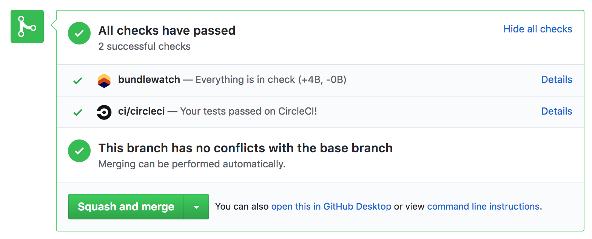

# The Best Parts
BundleWatch reports when files are over maxSize, but can also:
- Report build statuses back to GitHub
- Show how many files have changed (against develop, master etc)

## Build Status and Diffing
Let's run through getting setup up with build status:

### CI Variables needed by bundlewatch
The most efficient way to get this running is to ensure that some environment variables are available for BundleWatch to find.
- `CI_REPO_OWNER` github.com/**facebook**/react
- `CI_REPO_NAME`  github.com/facebook/**react**
- `CI_BRANCH`
- `CI_COMMIT_SHA`

If you're using, _Travis_, _CircleCI_ or _Wrecker_ these should all work out of the box.

!> Have a look at the source code to see which variables are automatically found: https://github.com/bundlewatch/bundlewatch/blob/master/src/app/config/ciEnv.js#L36-L39

> If CI variables aren't for you, you can also set them using config files or the Node API.

### CI Auth Variables Needed by BundleWatch
- `BUNDLEWATCH_GITHUB_TOKEN`

You will need to give BundleWatch access to your GitHub Statuses, which can be done by heading to:
https://service.bundlewatch.io/setup-github

This will give you your `BUNDLEWATCH_GITHUB_TOKEN`. You will need to set this as an environment variable in CI.

!> Ensure you keep this token secret, so rouge parties can't write to your repo statuses.

## Diffing Against Branches Other Than Master
After setting up the above, BundleWatch will automatically diff against master.

If you want to set up diffing for other branches (e.g. develop) there is one more CI variable that is required.
- `CI_BRANCH_BASE`
